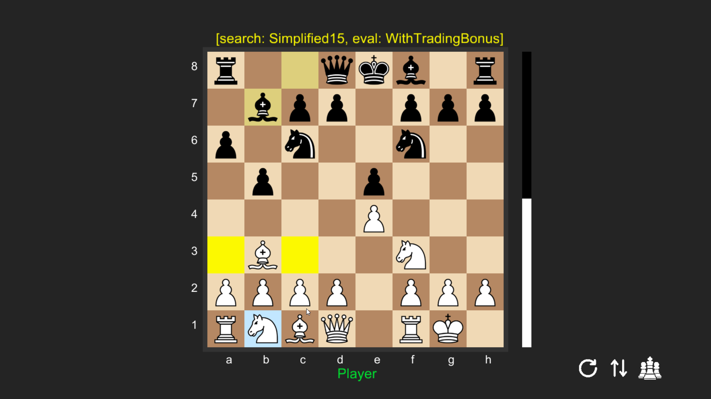

# Magnus Carlblunder ♟️

A Rust-powered chess engine with a built-in GUI, a move generator, and **30 experimental search versions** you can pit against each other. The strongest version plays at super-grandmaster (2800) strength. All handcrafted by me.


---

## ✨ Features

- 🖥️ **Graphical User Interface (GUI)** – Play against the engine in a clean, visual environment.
- 🔍 **Custom Move Generator** – Implements MVV-LVA ordering, killer moves, history heuristics, and more.
- ♻️ **Quiescence Search** – With SEE (Static Exchange Evaluation) and delta pruning.
- ⚡  **Negamax Core** – Supports null-move pruning, late move reductions, and search extensions.
- 🔀 **30 Search Versions** – Compare algorithms head-to-head and watch them blunder (or shine).
- 🤖 **Bot Slayer** – Tested against bots, including the Hikaru bot… and it wins frequently 😉

---

## 📸 Screenshots

- Playing against the engine in the GUI:  
<p align="center">
  
</p>

---

## 🚀 Getting Started

### Prerequisites
- Rust
- Cargo package manager

### Build & Run
```bash
# Clone the repo
git clone https://github.com/yourusername/magnus-carlblunder.git
cd magnus-carlblunder

# Build the project
cargo build --release

# Run the GUI
cargo run --release -- --chess
